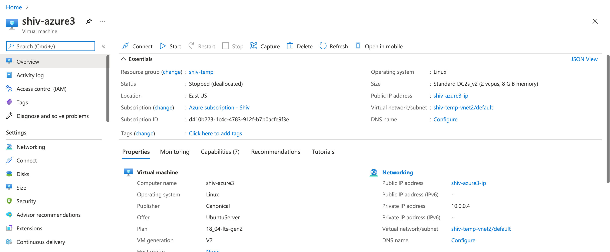
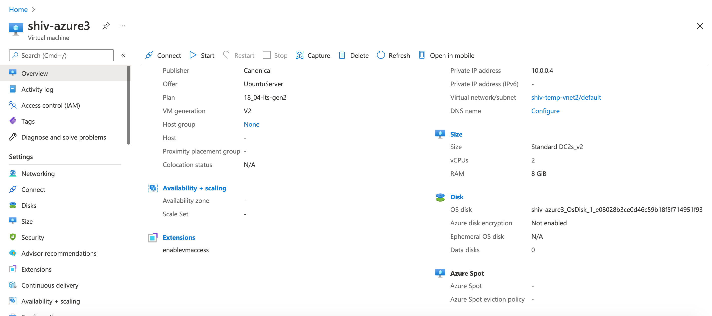

# Azure Instance Information

JSON configuration:
Resource ID: `/subscriptions/d410b223-1c4c-4783-912f-b7b0acfe9f3e/resourcegroups/shiv-temp/providers/Microsoft.Compute/virtualMachines/shiv-azure3`
```shell
{
    "name": "shiv-azure3",
    "id": "/subscriptions/d410b223-1c4c-4783-912f-b7b0acfe9f3e/resourceGroups/shiv-temp/providers/Microsoft.Compute/virtualMachines/shiv-azure3",
    "type": "Microsoft.Compute/virtualMachines",
    "location": "eastus",
    "properties": {
        "vmId": "7d5a1105-c406-46c0-96b7-097491ec017e",
        "hardwareProfile": {
            "vmSize": "Standard_DC2s_v2"
        },
        "storageProfile": {
            "imageReference": {
                "publisher": "Canonical",
                "offer": "UbuntuServer",
                "sku": "18_04-lts-gen2",
                "version": "latest"
            },
            "osDisk": {
                "osType": "Linux",
                "name": "shiv-azure3_OsDisk_1_e08028b3ce0d46c59b18f5f714951f93",
                "createOption": "FromImage",
                "caching": "ReadWrite",
                "managedDisk": {
                    "id": "/subscriptions/d410b223-1c4c-4783-912f-b7b0acfe9f3e/resourceGroups/SHIV-TEMP/providers/Microsoft.Compute/disks/shiv-azure3_OsDisk_1_e08028b3ce0d46c59b18f5f714951f93"
                }
            },
            "dataDisks": []
        },
        "osProfile": {
            "computerName": "shiv-azure3",
            "adminUsername": "shivendra",
            "linuxConfiguration": {
                "disablePasswordAuthentication": true,
                "ssh": {
                    "publicKeys": [
                        {
                            "path": "/home/shivendra/.ssh/authorized_keys",
                            "keyData": "ssh-rsa AAAAB3NzaC1yc2EAAAADAQABAAABgQCyuCTaURGVKSkJjnNskxS05HfP\r\nfDGk73vh1fugb0ymzQ0OLFJPPihZqPLC19a2iG8B9lESPqD3k6pcwusmFOcha9uk\r\n0PoX7GuGv7V+BcFnioreOkuuiv/yHQiF94Pbe4qbZI9myZT6G4fevCyXm/C1iOJy\r\nA2B+ud9pd6CWlLq/DUb17a4fqdRnTcyc26evjF2NpGFoFCW+VeHCXjkA8EcU9bUC\r\nW5ILufBiOUq4V7/nAwL+K0TrCub1U3CrXXg2LBsYWArh0o0JAVveZOIpaYUaeOcE\r\nJTwsajikj5oRf18rhQpyNtpTfooK69GerliM6Ka+jhrMIs2IQilZV6HH4+O7JE9w\r\n9mlRRV7sKgV2qtv5AcQMZtq2nHzoHztT8GVQydaHB1ZqnrwC+M32BjBVAiMRfezJ\r\nblF3SdDy/BtsRS0ESfAWdQDT8lTT4M0MwEp5Y4wzU7i9aHtqlzPMcyo9YXzZgqKa\r\n3O3dINaQ+StzsjnJR6UJjrmKP648HewPdrDKRwU= generated-by-azure\r\n"
                        }
                    ]
                }
            },
            "secrets": []
        },
        "networkProfile": {
            "networkInterfaces": [
                {
                    "id": "/subscriptions/d410b223-1c4c-4783-912f-b7b0acfe9f3e/resourceGroups/shiv-temp/providers/Microsoft.Network/networkInterfaces/shiv-azure3769"
                }
            ]
        },
        "diagnosticsProfile": {
            "bootDiagnostics": {
                "enabled": true
            }
        },
        "provisioningState": "Succeeded"
    },
    "resources": [
        {
            "name": "enablevmaccess",
            "id": "/subscriptions/d410b223-1c4c-4783-912f-b7b0acfe9f3e/resourceGroups/shiv-temp/providers/Microsoft.Compute/virtualMachines/shiv-azure3/extensions/enablevmaccess",
            "type": "Microsoft.Compute/virtualMachines/extensions",
            "location": "eastus",
            "properties": {
                "autoUpgradeMinorVersion": true,
                "provisioningState": "Succeeded",
                "publisher": "Microsoft.OSTCExtensions",
                "type": "VMAccessForLinux",
                "typeHandlerVersion": "1.4",
                "settings": {}
            }
        }
    ]
}
```



